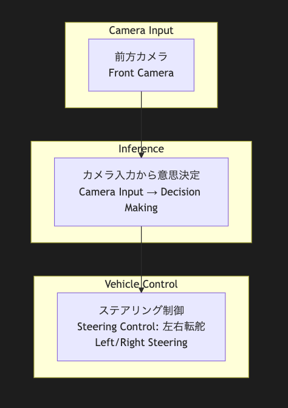

# TeslaFSD-Emu
- system図

## 本リポジトリ設計思想
- リポジトリ関係が簡素であること
- 軽量であること
- 構造が明確であること

## git clone
### git clone (+submodules)
`git clone --recursive https://github.com/kodai-n11qbb/TeslaFSD-Emu.git`

### git clone (no submodules)
`git clone https://github.com/kodai-n11qbb/TeslaFSD-Emu.git`